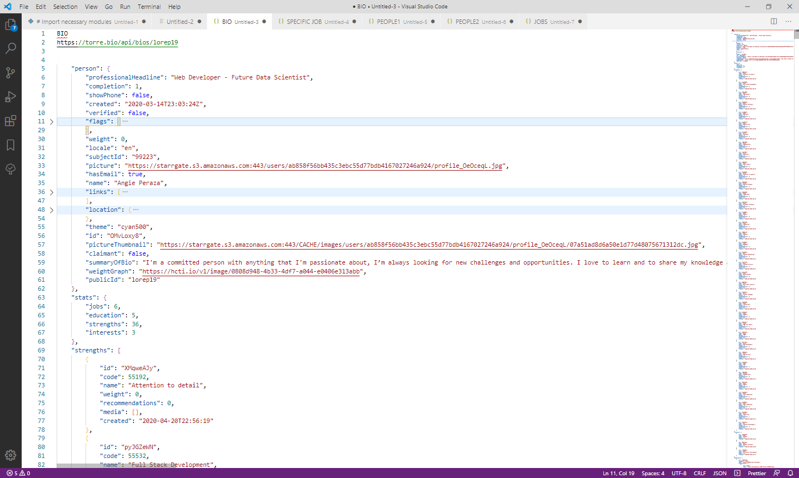
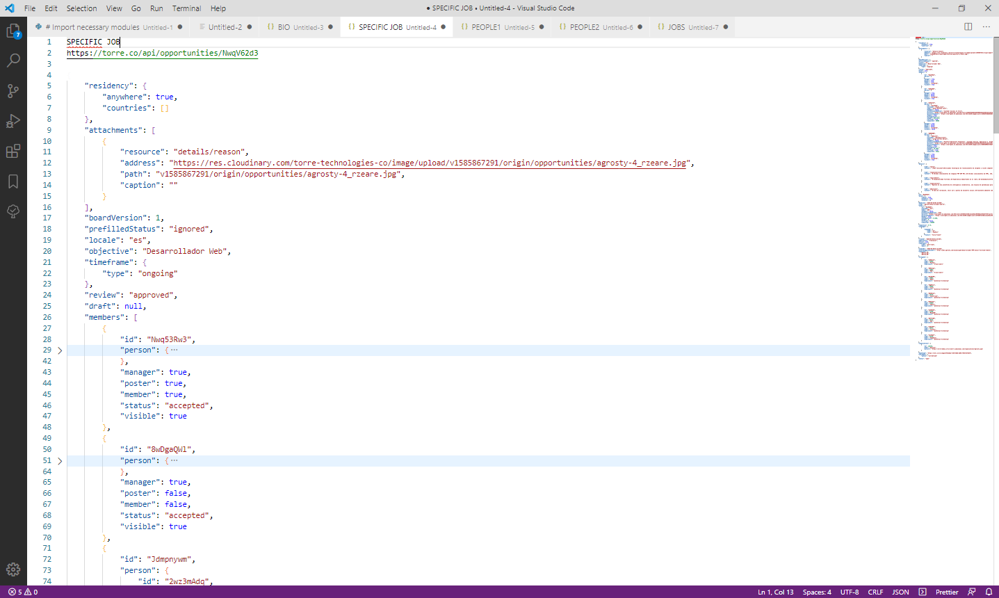
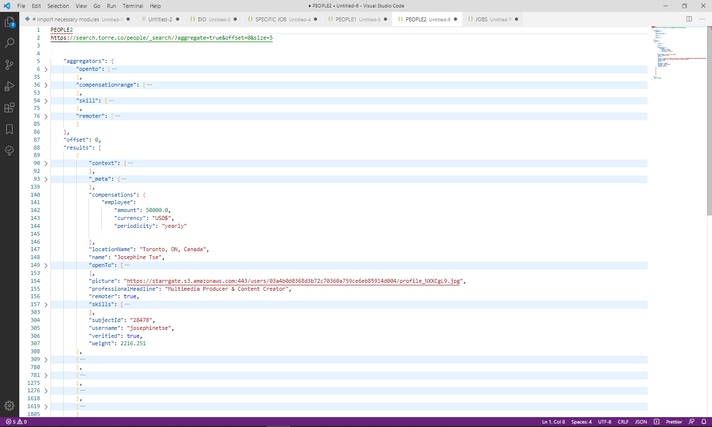
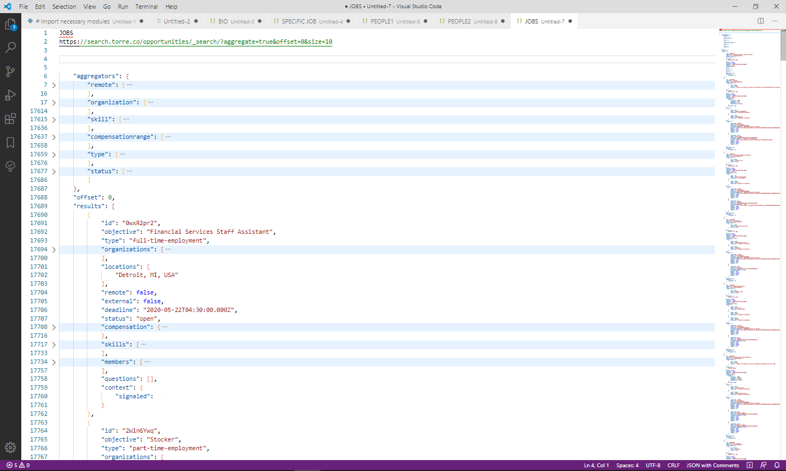
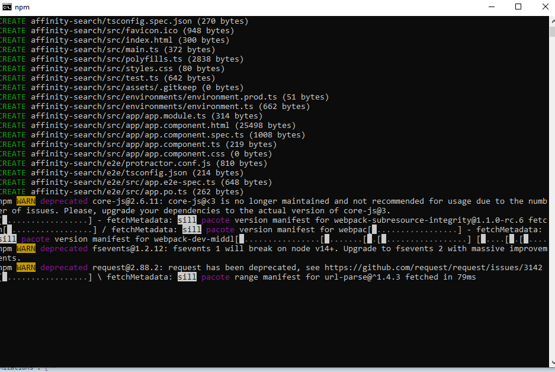
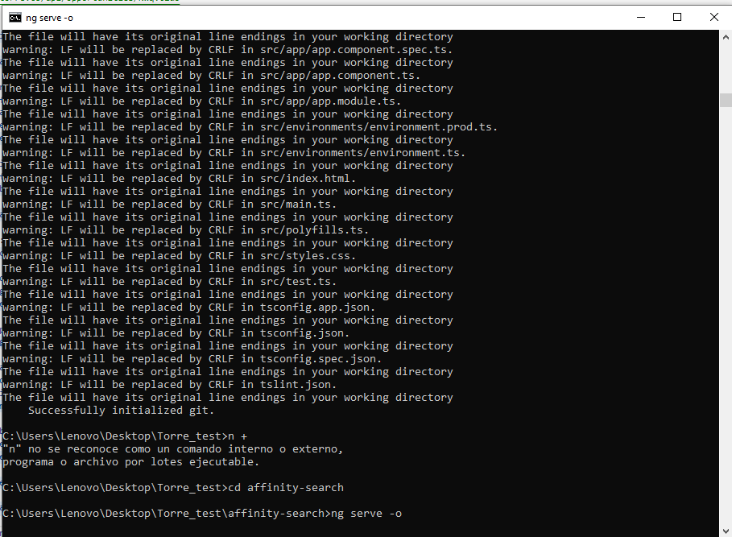
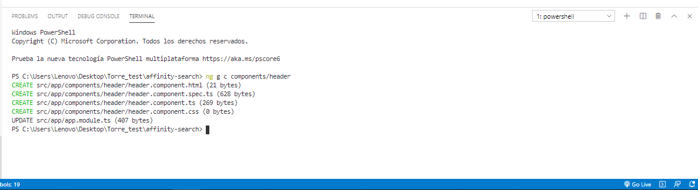
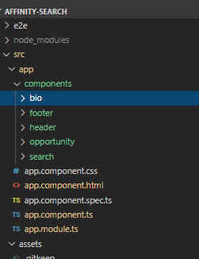
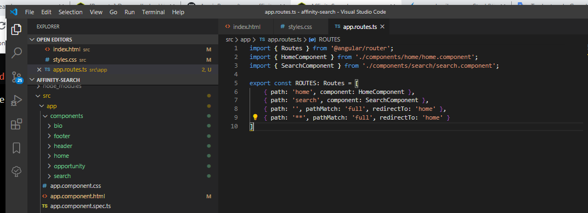

# AffinitySearch

This project was generated with [Angular CLI](https://github.com/angular/angular-cli) version 8.3.2.

## Development server

Run `ng serve` for a dev server. Navigate to `http://localhost:4200/`. The app will automatically reload if you change any of the source files.

## Steps done to the technical test

1. Explore the data to analyze and define what application to implement

2. Create the project

3. Create the necessary components

4. Set the corresponding routes

5. Start working on the project. This is the commit history:

`$ git clone https://github.com/AngiePeraza/affinity_search`

`$ git log --pretty=format:"%h - %an, %ad : %s"`

`ca7f6a0 - Angie Peraza, Thu Apr 23 00:49:09 2020 -0500 : ready to prod`

`6b7cefe - Angie Peraza, Thu Apr 23 00:33:13 2020 -0500 : Create dist folder`

`adebfa2 - Angie Peraza, Thu Apr 23 00:20:51 2020 -0500 : See bio details.`

`fa80dae - Angie Peraza, Wed Apr 22 22:09:09 2020 -0500 : Search teams, show results divide by roles selected.`

`1f77731 - Angie Peraza, Wed Apr 22 19:53:30 2020 -0500 : Show compesation and location and control missing data`

`31c6bbe - Angie Peraza, Wed Apr 22 19:19:24 2020 -0500 : Search by skill and experience and show the opportunity info in cards`

`41c6a87 - Angie Peraza, Wed Apr 22 17:17:51 2020 -0500 : Get skills and levels and show them in the page  to start searching`

`4593d36 - Angie Peraza, Wed Apr 22 14:16:16 2020 -0500 : Get bio data and show it in home component`

`fd31c22 - Angie Peraza, Wed Apr 22 10:12:52 2020 -0500 : initial commit`

## Results

Based on the data, I decided to build an affinity search functionality: 

### Searching for jobs
- **Important:** The 'connected user' is set with my username by default and, for this version, there is no option to change it or to login with another user. 
- The user can see his/her current strengths and search for opportunities based on one of them previous selected.
- The user will see the available opportunities with the information about skills required (highlighting the one searched by the user), compensation and location.  
- Once the user clicks on one opportunity, the app should show the opportunity details. But, unfortunately, it was not possible to build this feature due to issues querying this specific endpoint. 

### Searching for teams
- **Important:** It was built an approximation of the main idea.
- The user should be able to search different roles to create a team (in this case, the roles are for a software development project specifically). 
- The search should take into account coincidences between the candidates in order to render better results. For this version, it's just taking into account the languages of the connected user.
- There will be a section per each role with the candidates suggested.
- The user will be able to see the details of a specific candidate. The app will show the information about the experience, languages and interests.

- There are some features missing. For example: 
  - The user cannot go back to see another candidate of a previous team suggested, it will be needed to search for the team again.
  - To reset the selected roles it is needed to refresh the entire page.
  - There is no pagination, the queries are always returning 10 values.
  - The login page or option to change username, previously mentioned.
  
### Demo Video: [https://www.youtube.com/watch?v=avyhG5Uw_Gs](https://www.youtube.com/watch?v=avyhG5Uw_Gs)
### Link to test: [https://angieperaza.github.io/affinity_search/](https://angieperaza.github.io/affinity_search/)